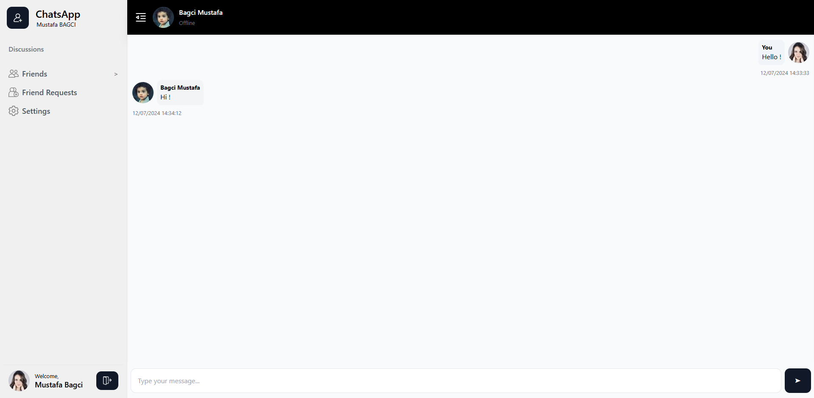

# Real-Time Chat Application

## Overview



This is a real-time chat application built using **Express.js** and **WebSockets (Socket.io)**. The project enables multiple users to communicate in real-time within a shared chat room.

## Features

- **Real-time messaging** using WebSockets.
- **Multiple user support** with unique usernames.
- **User join/leave notifications**.
- **Typing indicators** to show when a user is typing.
- **Simple UI** for seamless chatting experience.

## Technologies Used

- **Node.js** & **Express.js** - Backend framework
- **Socket.io** - WebSocket communication
- **HTML, CSS, JavaScript** - Frontend

## **Installation & Setup**

### Prerequisites

Ensure you have **Node.js** installed on your system.

### Steps to Run the Project

1. **Clone the repository:**

   ```bash
   git clone https://github.com/Mustafa-Bagci/realtime-chat-express.git
   ```

2. **Navigate to the project folder:**

   ```bash
   cd realtime-chat-express
   ```

3. **Install dependencies:**

   ```bash
   npm install
   ```

4. **Run the application:**

   ```bash
   node server.js
   ```

5. **Access the app in a browser:**
   Open `http://localhost:3000` in your web browser.

## Project Structure

```
realtime-chat-express/
├── public/          # Static frontend files (HTML, CSS, JS)
├── server.js        # Main server file (Express & Socket.io setup)
├── package.json     # Project dependencies
└── README.md        # Project documentation
```

## Future Enhancements

- User authentication
- Private chat rooms
- Message history storage
- UI improvements

## Contributing

Contributions are welcome! Feel free to submit a pull request.

## License

This project is licensed under the MIT License.

